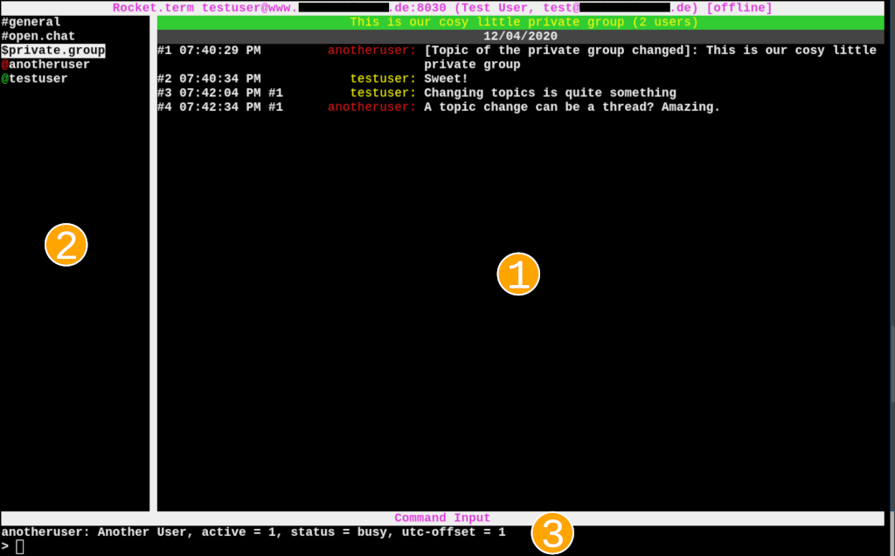

# rocket.term

## About

rocket.term is a text based chat client for the Rocket.chat [1] messaging
solution.

[1]: https://rocket.chat

### Why a Text Based Client?

If you are anything like me then you appreciate lean and mean and efficient
software. While the feature set of Rocket.chat is nice, the default web
interface is sometimes confusing to me or too dynamic or it simply annoys me
that it runs in the web browser instead of in a dedicated application.

### How well does rocket.term work?

Currently it is still in a kind of beta stadium. But you should be able to
reliably use in everyday work, while it can happen that something breaks once
in a while or in unexpected corner cases.

### What can it do?

Among other things:

- It provides access to subscribed chat rooms, hiding/showing them,
  writing messages in them, retrieving the full chat history.
- Message threads are supported.
- Getting basic user info from other users, setting the own user presence
  status.
- Reading and setting room topics.
- Creating new direct chats with other users.
- Creating new chat rooms or private groups.
- Joining or leaving open chat rooms.
- Inviting or removing other users into chat rooms or private groups.
- Leaving private groups.
- Uploading and downloading file attachments.

Currently it focuses on the basic chat features. More features are in the
pipeline.

### What does it look like?

Something like this:



## What is the Intended Audience?

Power users, technically skilled people or users interested in an efficient
and fun interface for Rocket.chat.

### What is it not?

It is not a full replacement of the web interface in terms of configuration
and settings. It concentrates on the actual and most frequently used chat
features.

## Installation

### Requirements

You need a Linux PC and a terminal to run rocket.term in. In theory it could
also work on operating systems other than Linux but it wasn't tested yet. You
will need a fairly recent Python 3 interpreter and the following additional
Python modules:

- [the urwid module](http://urwid.org) (a toolkit for text based UIs).
- [the requests module](https://requests.readthedocs.io/) for easier handling of HTTP REST API requests.
- [the websocket client module](https://github.com/websocket-client/websocket-client) for connecting to the Rocket.chat websocket realtime API.

### Typical Install

The `setup.py` script that is part of this repository allows you install
rocket.term for your user account or system wide:

```
# for user account only
user$ cd rocket.term
user$ ./setup.py install --user

# system wide
user$ cd rocket.term
user$ sudo ./setup.py install

# or directly as root
root# cd rocket.term
root# ./setup.py install
```

Otherwise you can try looking for a packaged rocket.term in your Linux
distribution. At the moment there are none that I know of, however.

rocket.term comes with a single executable script named `rocketterm` that
starts the application. If installed system wide then you will typically find
it in `/usr/bin/rocketterm`, if installed for the user account only you will
find it in `~/.local/bin/rocketterm`.

### Starting it from the Repository

For development or testing you can also start rocket.term directly from the
repository via `./bin/rocketterm`, provided that the Python module
dependencies are already installed.

## How to Use it

### Configuration

rocket.term uses a simple INI style configuration file that is by default
expected at `~/.config/rocket-term.ini`. The minimum configuration consists of
the remote server address, the username and authentication information. A
template configuration file is shipped with rocket.term that you can adjust to
your needs. When you run `rocketterm` for the first time (after installing it
via `setup.py`) then it will create the template configuration file at the
default location for you to adjust.

For authentication it is recommended to create a personal access token via the
Rocket.chat web interface. This token can be configured in rocket.term to
authenticate against the Rocket.chat server. It is also possible to use a
cleartext password or to produce the password from an external command (e.g.
password manager).

To generate a personal access token, login to Rocket.chat via the web browser,
click on your profile picture in the top left corner, select "My Account" and
then "Personal Access Tokens" from the list on the left. Then follow the
instructions to add a new token for rocket.term. If the menu item "Personal
Access Tokens" is not available then the Rocket.chat instance might not allow
the use of tokens. You can try to talk to the Administrator of the server to
enable this feature.

The INI file allows furhermore customization of key bindings, colors and hooks
to be invoked upon certain chat events. Refer to the template configuration
file for a more complete documentation of what you can do.

### Different Rocket.chat Room Types

Rocket.chat supports three different room types that users of the web
interface might not be fully aware of:

- **Chat rooms**. These are visible to all users on the chat server and typically
  anybody can join them and participate. In rocket.term these rooms are
  prefixed with a `#` character to reference and distinguish them.
- **Private groups**. These are similar to chat rooms but can only be seen by a
  restricted group of people and can only be joined by invitation. In
  rocket.term these rooms are prefixed with a `$` character to reference and
  distinguish them.
- **Direct chat**. These are used for direct communication between two users
  only. They are created on-the-fly upon sending a direct message to another
  user. In rocket.term these rooms are prefixed with an `@` character (the
  same as for usernames) to reference and distinguish them.

Your user account is subscribed to a certain set of rooms. Each subscribed
room *can* be displayed, but it can also be hidden. When it is hidden then
other users can still mention you explicitly to make the room appear again.
When you're unsubscribed from a room then you won't be reachable there any
more. This is not the case for direct chats, obviously.

Subscribing and unsubscribing from chat rooms or private groups is not yet
supported from within rocket.term. You will need to do that via the web
interface.

### rocket.term Screen Layout

The largest part of the screen is made up of the display of the currently
selected chat room's messages. This is the element in the upper right corner
marked with (1) in the screenshot above. On the left you will find the list
of the currently visible rooms for your account (2). At the bottom of the
screen you will find a status output bar and a command input widget where you
can enter commands and chat messages (3). The status output bar will
display feedback for the most recent command that was entered.

### Chat Message Display

Rocket.chat provides complex and dynamic features like seperate thread
discussions, message editing or adding reactions to other users' messages.
rocket.term attempts to tame this complexity. Each displayed chat message
follows the following format:

```
<#NR> <TIME>         [#THREAD-NR] <USERNAME>: <MESSAGE>
#1    10:44:10 PM                 testuser:   My first message
```

- new messages and events are only appended at the bottom of the chat window.
  This way the chat history does not need to be checked for changes happening
  long after the message was posted.
- each message is assigned a unique consecutive message number `#NR`. These
  numbers are prefixed with a `#` character and the first message starts
  counting at `#1` for each room. The number monotonically increases as new
  chat messages appear in a room. Some of the available commands also expect
  one of these message numbers as parameter.
- when a message or event refers to another message then these consecutive
  numbers are used to make the connection visible. For example threads are
  handled this way, the third column of each message is the optional thread
  root message #nr.

### Entering Commands

Any normal text entered will be posted verbatim as a new chat message. You can
add certain markup that is interpreted by the Rocket.chat server like markdown
or smiley syntax (e.g. `:smiley:`). By using the up and down arrow keys you
can browse through the history of messages and commands previously entered.
Basic command line editing is supported via backspace and left and right arrow
keys.

Commands start with a `/` character. Basic tab completion is supported to
complete commands and certain parameters like usernames or chat room names.
Basic online help is available via `/help COMMAND`. Commands use shell style
parsing. Commands can accept parameters. If a parameter contains whitespace
then it needs to be quoted "like this".

Certain parameter types like room names or usernames follow the same scheme
for all commands. They need to be prefixed by their individual character like
`#` for chat rooms, `$` for private groups or `@` for usernames or direct
chats. After entering the type character tab completion becomes possible. Tab
completion is sometimes context sensitive. For example you can only `/open`
rooms that are currently hidden, while you can only `/hide` rooms that are
currently open.

### Keyboard Controls

Apart from writing messages and entering commands there are a few additional
keyboard controls available:

| Key(s) |                   Description                                    |
|:------:|------------------------------------------------------------------|
| `Page-up`/`Page-down` | This will scroll through the message history of the currently selected chat room.|
| `Meta+Page-up`/`Meta+Page-down`| Like above but this will scroll only a single message at a time.|
| `Home`/`End` | This will scroll to the oldest/newest message in the chat history. Note that scrolling to the oldest message requires to retrieve the complete chat history from the server, which can take a long time in rooms with many messages. |
| `Shift+Arrow-up`/`Shift+Arrow-down`| This will select the previous / next room with activity, if any. Rooms with activity are shown in different color in the room list. This allows you to quickly walk through rooms with recent changes.|
| `Meta+Arrow-up`/`Meta+Arrow-down`  | This will select the previous / next room in the room list. |
| `Meta+q` | Quits the application. |
| `Ctrl+v` | Allows to enter raw control sequences like newlines and tabs. |

The `Meta` key mapping depends on the terminal you use but it is typically the
`Alt` or `Control` key.

You can also customize these default key bindings in the INI configuration
file to your liking.

### Opening URLs

URLs in chat messages are treated specially by the Rocket.Chat server. It
tries to obtain additional metadata about a website and displays it in a
follow-up chat message. This can include the author name, the page title or
a page excerpt.

Indepentenly of any available metadata, rocket.term supports opening URLs via
the `/urlopen [URLSPEC]` command. Each URL encountered in a chat room will be
assigned a unique number like `[12]`. To open it the command `/urlopen [12]`
can be used. The URL will be opened in the browser specified in the `BROWSER`
environment variable. Currently the browser will be executed in the
foreground. This means that rocket.term will be unavailable until you close
the browser. If the browser runs in the terminal and rocket.term will attempt
to restore the original terminal settings and redraw itself. You can also
point `BROWSER` to a program that continues running in the background to keep
rocket.term available while you are looking at the URL.

### Downloading and Uploading Attachments

The `/upload`, `/download` and `/openfile` commands support uploading,
downloading and opening file attachments. Files are attached to chat messages
and are identified similarly to URLs with a unique number syntax like `[!4]`.

Similarly to URL open handling the execution of rocket.term will be suspended
for large file downloads, or if opening downloaded files in external
applications that run in the foreground.

### Minor Things Good to Know

- the `@` prefix for direct chats displayed in the room list is colored
  according to the current user status of the respective chat partner.
- there is no widget to display the users that are members of the currently
  selected room. You can use the tab completion feature after entering the `@`
  user prefix to find out about the users known in the current room. There is
  currently a limit of 50 users, however, that are loaded for each room.
  Otherwise the time needed to load all the data for each room would be too
  high for rooms with a lot of users. Further users are loaded lazily as
  they appear in messages etc. When using the `/whois` command, rocket.term
  will load a complete user list from the server when tab-completing usernames.

### Limitations

- There is currently an inefficiency in the implementation of how chat rooms
  are processed. When you load the complete history for a room with many
  message (say more than a few thousand messages), then switching to these
  rooms can cause a noticable delay. The reason behind this is that each time
  a room is selected *all* locally cached messages will be processed and
  rendered again. To avoid this in the future the rendered messages will have
  to be cached but this is a larger work item and requires some redesign of
  the code base.
- Depending on the quality of your network connection and the load and
  reliability of the Rocket.Chat server, the API connection to the server can
  break. rocket.term attempts to display a message in the status bar when this
  happens. You can also configure a hook script in the INI file which will be
  invoked when the connection fails. Another type of behaviour I have seen is
  that asynchronous server events are not sent any more by the server although
  the connection as such remains open. In this case you can send out messages by
  they will not appear, because no updates are received from the server. When
  reconnecting you will typically see the messages you typed previously. There
  is little what rocket.term can do about these strange states, except maybe
  implementing a timeout or a keepalive protocol to recognize the situation.
- I have witnessed artifacts in chat rooms with many users and old chat
  history. For example users have somehow been removed from the server and
  appear as `deleted_user123` suddenly. Another thing are references to
  message threads that are no longer found in the chat history. When this
  happens then rocket.term will load the complete room history to resolve
  these referenced messages but will give up in the end and display the
  related message thread with a `#???` message nr. Since these are
  inconsistencies on the server side there is little rocket.term can do about
  it.

### A Note about Data Retrieval and Application Reactiveness

rocket.term does not maintain a local disk cache of server data. This means
every time it is started all data needs to be retrieved from the server. For
this reason most data is only loaded on demand as new rooms are selected, as
new users appear and as chat history is loaded actively by the user.

Loading large user lists or the complete history of a chat room with many
messages can take a longer time. For the most common operations of this kind
feedback will be displayed in the status output bar so you know what is going
on. There is currently no way to interrupt long lasting operations on user
request.

## Contributing and Bug Reporting

Please use the GitHub features to open issues or to provide pull requests.
Regarding coding style please follow the flake8 style checker and otherwise
the style that you find in the existing code.

## Technical Background

Rocket.chat provides different APIs interfaces. They're all more targeted
towards web clients. The documentation for the APIs looks good at first sight.
But there is missing some overarching documentation, how the API behaves in
detail in some spots, what certain data structure fields mean and so on. So
some experimenting might be needed when implementing new features.

Important to note are the following aspects:

- the REST API provides a lot of the more static information, but it is not
  possible to do an efficient wait for new messages, for example.
- the "realtime API" which is based on web sockets allows to subscribe for
  asynchronous events like new messages. However it misses some of the more
  static information that the REST API provides (e.g. user information, details
  about groups, channels, etc.)

Therefore both APIs need to be employed which complicates matters a bit.

The REST API also enforces rather strict DoS protection mechanisms by default.
Doing a lot or larger queries there can result in artificial delays being
introduced or the connection being terminated.

There is also something called a "livechat API" in the Rocket.chat docs. Don't
let yourself be confused by this. This is a special feature that allows
anonymous users e.g. on websites to be linked into Rocket.chat.

## License

This software is licensed under the GNU GPL version 2.0. See the accompanying
LICENSE file for more information.
